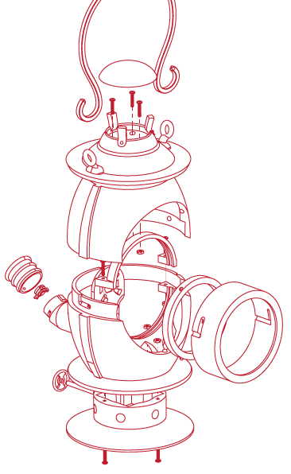
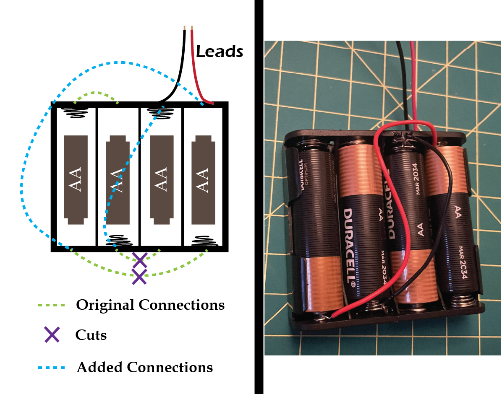
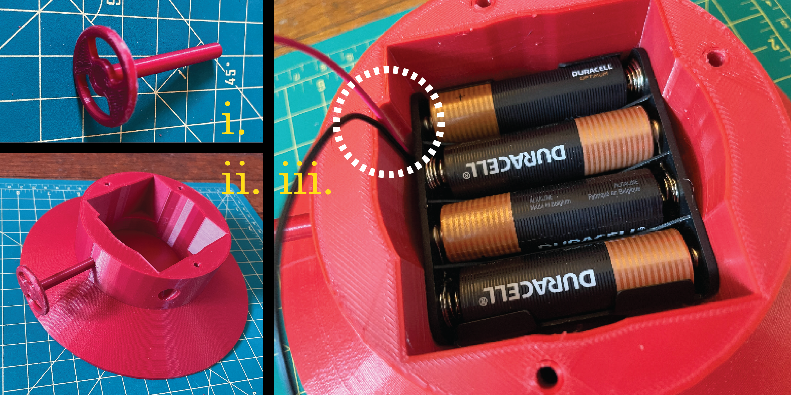
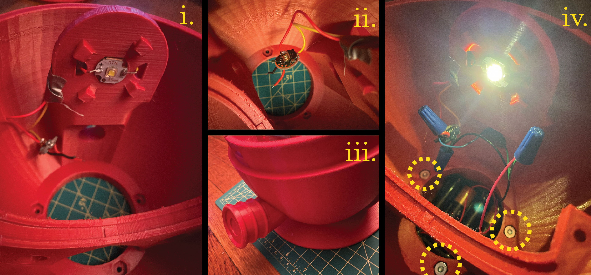

# Over the Garden Wall: The Dark Lantern

## Introduction

What follows is a guide for the assembly of a 3D-printed lantern that is modeled after the one featured in the show _Over the Garden Wall_. You will need to be able to solder if you wish to have the functionality of the light, and a couple other miscellaneous materials like wire, tin foil, and tape. Assuming prints are successful and generally low infill, all the printed pieces can be completed with a single 1kg roll of filament. 

## Materials

| Part | Vendor | Part Name | Price | Order Date |
|------|--------|-----------|-------|------------|
| [LED](https://www.mtnelectronics.com/index.php?route=product/product&product_id=999&search=Luminus+SST-40+N5+5000K+LED+on+Copper+DTP+MCPCB+) | Mountain Electronics LLC | Luminus SST-40 N5 5000K LED on Copper DTP MCPCB - 16mm | $6.79 | 1/26/25 |
| [LED Driver](https://www.mtnelectronics.com/index.php?route=product/product&product_id=52&search=QLITE+REV.A+7135%2A8+3.04A+LED+DRIVER+-+17mm+) | Mountain Electronics LLC | QLITE REV.A 7135×8 3.04A LED DRIVER - 17mm — Alternate Firmware: Single Mode (100%) | $4.35 | 1/26/25 |
| [Reflector](https://www.digikey.com/en/products/detail/ledil/C18319-ADELIA-110-S/17738377?s=N4IgTCBcDaIOwEYEFoDCCAcBmBBOA%2BgIIAiAogDICShySADMgMrIByxIAugL5A) | DigiKey | 711-C18319_ADELIA-110-S-ND | $9.95 | 1/27/25 |
| [Lens 1](https://www.digikey.com/en/products/detail/ledil/C18555-AMY-110-S/17738394?s=N4IgTCBcDaIOwEYEFoDCCAcBWHB9AggLICaySADMgMrIByAIiALoC%2BQA) | DigiKey | 711-C18555_AMY-110-S-ND | $11.48 | 1/27/25 |
| [Lens 2](https://www.aliexpress.us/item/3256807704562444.html) | AliExpress | Glass Fresnel Thread Lens - D110MM F100MM | $18.58 | 1/26/25 |
| [Button Switch - taken from flashlight](https://www.amazon.com/dp/B01B8VPM7A) | Amazon | HAUSBELL A100 LED EDC Flashlight | $8.29 | 10/16/24 |
| [Battery Holder 4AA](https://www.digikey.com/en/products/detail/keystone-electronics/2478/303823) | DigiKey | 36-2478-ND | $2.02 | 10/14/24 |
| [Screws and Nuts](https://www.homedepot.com/p/6-32-x-3-4-in-Zinc-Plated-Combo-Round-Head-Machine-Screw-8-Pack-831481/317479032) | Home Depot | #6-32 x 3/4 in. Zinc Plated Combo Round Head Machine Screw (8-Pack) #1006547981 | $1.47 | N/A (Bought in Store) |

...and of course, your choice of filament. I used [this](https://www.amazon.com/dp/B0C9CJT7RS?th=1), the Deep Red PLA from Ender Creality, as I found the color to match quite well to show's. 

## Instructions

The lantern is divided into 3 main sections that can be constructed independently, then combined. The **Top** only consisted of printed parts, apart from the three screws/nuts that hold the larger pieces together. The **Front** is essentially the necessary components to hold and position the main lens. The **Bottom** holds all the electronics, the batteries, LED, LED driver, and switch. A soldering iron is needed for this assembly. The bottom and top sections slide together and the front slides into both, rotating into a locking position that secures all three.

### Top

##### Parts
_6 Printed Pieces, 3 screws/nuts_
* Hood
* Main-Top-Half
* Cap
* Handle-Grip
* 2 Handle-Halfs
* 3 Screws/Nuts (Not pictured above)

##### Procedure

Put each Handle-Half through the rings on the Hood. Push the split ends through the Handle-Grip to lock them in place. Make sure to push as far as possible. It is possible to take them out again if absolutely necessary, but quite difficult. To connect the Main-Top-Half to the Hood, three screws will be place through the top of the Hood, and match to nuts on the inside of the Main-Top-Half. The order of these steps is non-essential, but make sure to have screws and nuts in place before gluing the Cap to the top of the Hood.  

### Front

##### Parts
_2 printed pieces, Main Lens, Tin Foil, Tape_
* Main Lens
* Front-Ring
* Front-Ring-Inner
* Tin Foil (Not pictured above)
* Tape (Not pictured above)

##### Procedure

The main lens fits into Front-Ring, with Front-Ring-Inner sliding in behind, which is able to rotate after a certain distance, locking both in place. A few strips of tin foil can then be placed along the inside of the Front-Ring, secured with tape, for the purpose of preventing any light bleeding through the side of the ring. Some light will inevitably bleed through the very front of the Front-Ring, but it is difficult to notice due to the brightness of the light itself through the glass.

### Bottom

Above are most of the printed parts necessary for the Bottom section of the Lantern. It will be assembled in stages.

#### Spout

##### Parts
_4 Printed Parts, Switch_
* A: Switch
* B: Spout-Button
* C: Spout-Base
* D: Spout-End
* E: Spout-Wire-Pinch

##### Procedure

The spout holds the ON/OFF button switch, the actual switch part salvaged from a [flashlight](https://www.amazon.com/dp/B01B8VPM7A). As seen in **(i.)**, Switch-Wire-Pinch, allows for a wire to be looped through the small hole and along the outside, pinching it to the inner section of the switch. Another wire will then have to be soldered to the middle section of the switch. **(ii.)** The Spout-End holds the Spout-Button, while **(iii.)** the switch sits within the Spout-Base. Both wires from the switch will eventually be snaked through the hollow part of the Main-Bottom-Half. **(iv.)** The Spout-End and Spout-Base slide and rotate to fit together. 

#### Battery

##### Parts
* Battery Holder
* Extra wires

##### Procedure
The battery holder is designed to hold 4 AA batteries in series, which would provide approximately 6V. However, the LED Driver is expecting an input voltage of 2.8V to 4.5V. But, with a couple of cut connections, and a couple more added, we modify the part to place the two halves in series, connected together in parallel, to give the required ~3V. The green dotted lines represent the built-in connections on the battery holder. The purple X's represent the connections you'll need to severe. The blue dotted lines are the connections you'll need to solder with extra wires. The soldering will need to be done quickly and carefully, as heat the metal attachments with the soldering iron for too long will melt the plastic of the battery holder. And obviously, do not do the soldering with the batteries in place. 

#### Base, Axle, Wheel

##### Parts
_3 Printed Parts, Altered battery holder_
* Axle
* Wheel
* Base
* Altered battery holder

##### Procedure
**(i.)** The axle fits into the wheel, and **(ii.)** the hole in the base. Both should be secured with glue. **(iii.)** Lastly, the battery holder will fit into the base. The hole in the base has a divot (white dashed circle) that gives extra space for the battery leads. Note: The photo was taken before altering the battery holder, but it should be altered before adding.

#### Electrical Circuit
##### Parts
* LED
* LED Driver
* Main-Bottom-Half
* Completed Base and Battery Holder
* Completed Spout
* 3 Screws and Nuts
* Extra Wires

##### Procedure
**(i.)** The LED can be glued to the indent at the top of Main-Bottom-Half. Wires to the LED pads should be soldered before gluing. Once glued, the wires can be maneuvered through the nearby holes where they should eventually be attached to the LED Driver. 

**(ii.)** Attach the wires you've soldered top the LED to the LED Driver, as directed by the graphic above. The spring on the LED Driver is high, and the coated edge is the ground. Solder the wires, using any of the holes along the edge for the ground connection. **(iii.)** If you haven't already, connect the spout to the Main-Bottom-Half. Pull the wires from the switch through the hole in Main-Bottom-Half. **(iv.)** Finally, connect the completed Base and battery to the Main-Bottom-Half with 3 of the screws and nuts.
The electrical circuit is extremely simple: One end of the battery module is connected directly to the LED Driver, while the other is connected with the switch in series. By this point, the outputs of the LED Driver should already be connected to the LED. 
Note: The power, driver, and LED are rather substantial, so the lantern is able to produce a fair amount of light. However, the reflector and lenses were chosen only for their size and appearance, not their optical properties and as such the “throw/flood” and light distribution were not taken into consideration or designed around. In any case, the light produced is quite bright and at a wide angle, which seems fitting given the appearance of the lantern.

#### Inner Additions
##### Parts
* Completed Electrical Portion
* Inner-Ring-Top
* Reflector
* Inner-Lens
* 2 Screws and Nuts

#### Procedure

**Add Reflector**. The 4 pegs surrounding the LED are designed to allow for the Reflector to slide into and rotate to hold. The wide part of the Reflector will sit within the cylindrical trough. (In the photo in may appear that the lip of the Reflector is behind the piece, but it is the red being reflected which is causing it to appear as such.)
**Add Inner Lens**. The peg within the trough will fit into the divots on the edge of the lens, ensuring it will not rotate.
**Add Inner-Ring-Top** with two final two screws and nuts. 

### Final Assembly

**(i.)** The Top and Bottom sections fit together via 3 grooves on the Bottom section (only one is visible in the photo), and 3 corresponding bumps on the inside on the Top section.
**(ii.)** A similar method secures the Front to the other two sections. The 3 bumps are seen in the photo above. Be aware that the Front only fits with a single orientation, as the longest of the grooves needs to be placed at the bottom bump. 
**(iii.)** At this point the Lantern should be completely assembled, and able to turn on with the button at and back!

